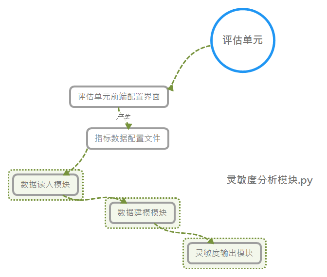

# 体系贡献率模块设计

## 1. 运行方式

通过评估单元的配置文件的解析，去数据库里面读出需要分析的指标/设计参数，和相应的评估结果的数据，然后通过读入的数据进行随机森林的回归模型的建模，训练完成模型的构建之后，输出相应的指标体系下的各个指标或者设计对评估结果的贡献率的重要性程度（图片，和文本数据的格式）。




## 2. 模块说明

1. 配置文件的格式
   
   指标读入配置文件的说明：
   ```json
   {
    "tableName1": {
        "type": 0,
        "Index":[
            "IndexName1",
            "IndexName2",
            "IndexName3"
        ]
    },
    "tableName2": {
        "type" : 1,
        "Index": [
            "IndexName4",
            "IndexName5"  
        ]
    }
}
   ```
   配置文件需要指定进行评估的时候所使用的指标的数据表，需要指定用了哪些表，每个表里面用了哪几列指标，表统一存储的原始指标是标量型：0， 还是非标量型: 1。

    指标分段的评估结果的存储格式，使用简单的csv格式：

```csv
SegmentId, StartTime, Endtime, EnvaluetedScore
```

使用csv逗号分隔符的形式存储各个分段的评估值，其中：
SegmentId：分段编号；StartTime：分段的开始时间；EndTime：分段的结束时间；EnvaluetedScore：该分段下的总体评估值。


2. 数据读取接口数据结构设计
   
数据读入接口需要首先解析配置文件，获取到相应的指标名称，同时基于读到的指标的数据名称构建相应的sql语句查询出相应的数据，或者更加配置文件指定的excel文件进行数据的读取，存储数据的时候使用list的数据结构。

3. 	数据分析模型设计

数据分析建模的设计主要基于读取到的数据进行随机森林回归模型的训练和构建，首先需要传入随机森林回归模型的参数进行模型的初始化，传入参数为：n：表示构建的随机森林的树的个数（树越多模型越准确），f：表示模型训练是使用的处理器的个数（-1表示使用所有的处理器。

4.	灵敏度分析结果输出模块设计

通过训练好的随机森林模型，输出其对应各个指标下的重要性得分即为各个指标的灵敏度定量分析结果，同时各个指标的灵敏度的结果以柱状图的的形式输出，保存到特定的文件路径，以供后续的界面显示使用，因此输出模型需要传入的参数是保存灵敏度结果的图片的filename，filename需要包含路径名（绝对路径或者相对路径）和保存生成的文件名，如一个示例为：filename=./out/image/灵敏度.png，表示为当前目录下的out目录下的image目录下的灵敏度.png的文件名。
